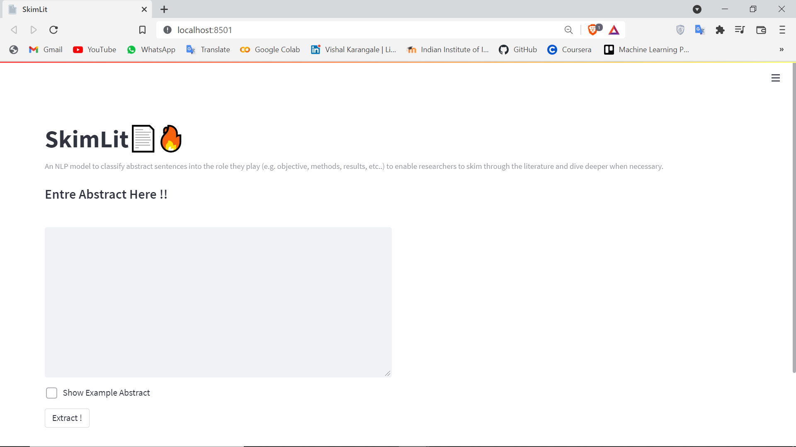
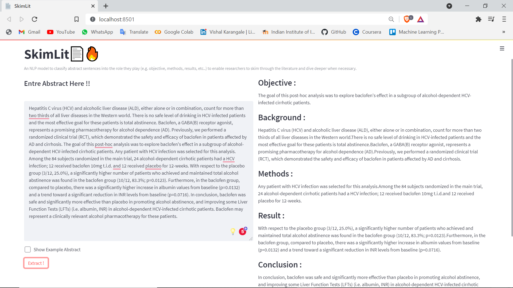

# SkimLit
An NLP model to classify abstract sentences into the role they play (e.g. objective, methods, results, etc..) to enable researchers to skim through the literature and dive deeper when necessary.

Try Demo; **[WEB APP](https://huggingface.co/spaces/Vrk/SkimLit)**

* **More specificially, I'am going to replicate the deep learning model behind the 2017 paper [*PubMed 200k RCT: a Dataset for Sequenctial Sentence Classification in Medical Abstracts*](https://arxiv.org/abs/1710.06071).**

## Dataset Used
[PubMed 200k RCT dataset](https://github.com/Franck-Dernoncourt/pubmed-rct)

* The PubMed 200k RCT dataset is described in *Franck Dernoncourt, Ji Young Lee. [PubMed 200k RCT: a Dataset for Sequential Sentence Classification in Medical Abstracts](https://arxiv.org/abs/1710.06071). International Joint Conference on Natural Language Processing (IJCNLP). 2017.*

Some miscellaneous information:
- PubMed 20k is a subset of PubMed 200k. I.e., any abstract present in PubMed 20k is also present in PubMed 200k. 
- `PubMed_200k_RCT` is the same as `PubMed_200k_RCT_numbers_replaced_with_at_sign`, except that in the latter all numbers had been replaced by `@`. (same for `PubMed_20k_RCT` vs. `PubMed_20k_RCT_numbers_replaced_with_at_sign`).

- **Count Plot**

## Models Tried
All the note books are availabel [here]("https://github.com/vishalrk1/SkimLit/tree/main/Notebooks")

- NaiveBiase Model -> 72% Accuracy
- Conv1D Model -> 78% Accuracy
- Model using pretrained token embedding ( Universal sentence embedding ) -> 75% Accuracy
- Conv1D Model using character level embedding -> 73% Accuracy 
- Model with both token and charcter level embedding -> 76% Accuracy
- Model with token, character and position level embedding ( https://arxiv.org/pdf/1612.05251.pdf ) -> 81% Accuracy
<!--          -->
- Model described in [this](https://arxiv.org/pdf/1612.05251.pdf) paper with bert embedding -> 88% Accuracy
## Final Results

### **Results of all Models**

### **Best Performong Model**

### **Final Outputs** 

## Packages Used
- Tensorflow
- tensorflow_text
- tensorflow_hub
- sklearn
- Matplotlib
- numpy
- pandas
- spaCy

## Contact Me

    <a href="https://github.com/vishalrk1" target="_blank">
        &nbsp;
    </a>
<!--      -->
    <a href="https://www.linkedin.com/in/vishal-karangale-126492216/" target="_blank">
        &nbsp;
    </a>
     <a href="https://www.instagram.com/vishal_rk1/" target="_blank">
       &nbsp;
    </a>

